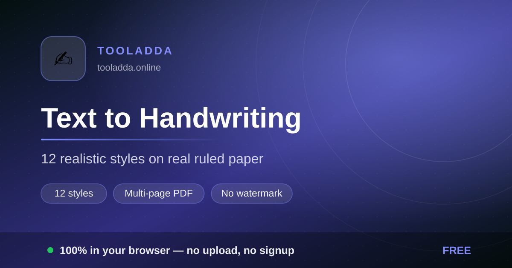
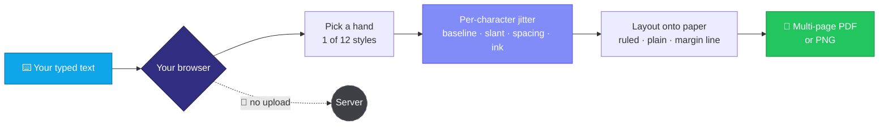

<div align="center">

<a href="https://tooladda.online/text-to-handwriting.html"></a>

# ✍️ Text to Handwriting

### Typed text → realistic handwriting on real ruled paper

[](https://tooladda.online/text-to-handwriting.html)
[](https://tooladda.online/text-to-handwriting.html)
[](https://tooladda.online/text-to-handwriting.html)


</div>

---

## ⚡ 10-second version

Paste your text at **[tooladda.online/text-to-handwriting.html](https://tooladda.online/text-to-handwriting.html)**, choose one of 12 hands, pick ruled or plain paper, and export a multi-page PDF. No watermark stamped across page 3, no signup wall at page 10.

> [!IMPORTANT]
> The text stays in your browser. Nothing about what you wrote — notes, a letter, an assignment, a journal entry — is uploaded, logged, or read by anyone.

---

## 🔬 Why most "handwriting" converters look obviously fake

Swapping in a cursive font is not handwriting. A font repeats the *same* glyph at the *same* baseline with the *same* spacing forever, and your eye catches that pattern in about half a second. Real handwriting is irregular in four specific ways:

| Realism lever | What real hands do | What a plain cursive font does |
|:--|:--|:--|
| **Baseline drift** | Lines wobble up and down by a millimetre or two, and slowly climb or sink across the page | Dead-flat, ruler-straight |
| **Letter spacing jitter** | Gaps vary word to word; letters occasionally collide | Metrically perfect, identical every time |
| **Slant variation** | Slant shifts as your wrist tires and your hand travels | One fixed angle for 2,000 words |
| **Ink weight** | Pressure changes; strokes darken and thin | Uniform opacity from first letter to last |

This tool perturbs those four properties per character instead of laying out a font. That's the whole difference between "someone wrote this" and "someone downloaded a font".

<div align="center">

[](https://tooladda.online/text-to-handwriting.html)

</div>

---

## 🧭 How it works



---

## ✨ What's inside

<table>
<tr>
<td width="50%" valign="top">

### 🖋️ 12 distinct hands
Neat print, hurried scrawl, looping cursive, tight engineering lettering. Different documents need different hands — a lab record shouldn't look like a love letter.

</td>
<td width="50%" valign="top">

### 📓 Real paper backgrounds
Ruled lines, margin rule, plain, grid. The paper is drawn behind the text at the right line pitch, so writing sits **on** the rule instead of floating near it.

</td>
</tr>
<tr>
<td width="50%" valign="top">

### 📄 Multi-page PDF
Long text flows across pages automatically with consistent margins — not one giant scrolling image you then have to slice up yourself.

</td>
<td width="50%" valign="top">

### 🌐 Many scripts
Latin plus Indic scripts, so this works for more than English coursework.

</td>
</tr>
<tr>
<td width="50%" valign="top">

### 🎨 Ink and pen control
Blue, black, or blue-black; nib weight and letter size adjustable. Matching your actual pen is what makes a printed page read as handwritten.

</td>
<td width="50%" valign="top">

### 🚫 No watermark, no signup
Export as many pages as you like. Nothing is stamped across your output and nothing is gated.

</td>
</tr>
</table>

---

## 🛠️ What people genuinely use it for

| Situation | Why the tool helps |
|:--|:--|
| 📚 **Handwritten notes to study from** | Reading your own material in a handwritten face is easier to revise from than a typed wall of text. |
| 🎨 **Invitations and cards** | A handwritten-looking insert without hand-writing sixty of them. |
| 🖼️ **Mockups and design comps** | Realistic handwriting inside a UI mockup, journal template or product shot. |
| ✒️ **Practising a letterform** | Print a page in a hand you're trying to learn and trace it. |
| 🎬 **Props for video and print** | A "found note" or diary page for a film, a game, or an escape-room puzzle. |
| ♿ **When writing by hand hurts** | For people with an injury, tremor or chronic pain, this produces handwritten-style pages without the pain. |

> [!WARNING]
> If an assignment is set as handwritten, the point is usually that **you** write it — submitting generated pages as your own handwriting is academic dishonesty at most institutions, and printed output rarely survives close inspection anyway. Use it for your own notes, for design work, and for the accessibility case above.

---

## 📖 Four steps to a page

```
1.  Open   →  tooladda.online/text-to-handwriting.html
2.  Paste  →  your text
3.  Style  →  hand, paper, ink colour, size
4.  Export →  multi-page PDF (or PNG per page)
```

**[▶ Open the converter — tooladda.online/text-to-handwriting.html](https://tooladda.online/text-to-handwriting.html)**

> [!TIP]
> Print on slightly off-white paper, not bright white — and if you're going for realism, print at a **slight** angle rather than perfectly square. Machine-perfect page alignment is the giveaway that survives even a good hand.

---

## ❓ FAQ

<details>
<summary><b>Is it free? Any watermark or page limit?</b></summary><br>
Free, no watermark, no page limit, no signup.
</details>

<details>
<summary><b>Can I use my own handwriting?</b></summary><br>
The tool ships 12 built-in hands. Reproducing your exact handwriting needs a trained font built from your own samples — a separate, much heavier process.
</details>

<details>
<summary><b>Does it work for Hindi and other Indic scripts?</b></summary><br>
Yes, several non-Latin scripts are supported. Conjunct-heavy scripts render best at a slightly larger size.
</details>

<details>
<summary><b>Will it look real when printed?</b></summary><br>
Convincing at a glance and in a photograph. Under direct inspection, printer toner sits on the paper differently from ink from a pen — there's no software fix for that.
</details>

<details>
<summary><b>Is my text uploaded anywhere?</b></summary><br>
No. Rendering happens on a canvas in your browser. Open the Network tab while you convert and you'll see your text going nowhere.
</details>

<details>
<summary><b>Can I get one image per page instead of a PDF?</b></summary><br>
Yes — PNG export per page, which is what you want for mockups and social posts.
</details>

<details>
<summary><b>Why does very long text take a moment?</b></summary><br>
Every character is drawn individually with its own jitter values. That per-character work is exactly what stops the output looking like a font, and it costs a little time on long documents.
</details>

---

## 🔬 Under the hood

- HTML5 `<canvas>` rendering, vanilla JavaScript, no framework and no build step.
- Jitter is applied per glyph across baseline offset, slant, tracking and opacity.
- Paper is drawn as a real layer at a correct line pitch, so text aligns to the rule.
- PDF assembled client-side; PWA-installable and offline-capable.

---

## 🧰 Related ToolAdda tools

<div align="center">

[](https://tooladda.online/worksheet-generator.html)
[](https://tooladda.online/online-notepad.html)
[](https://tooladda.online/paper-generator.html)
<br>
[](https://tooladda.online/images-to-pdf.html)
[](https://tooladda.online/pdf-compress.html)
[](https://tooladda.online/signature-resizer.html)

</div>

---

<div align="center">

### Type it once. Read it in your own hand.

[](https://tooladda.online/text-to-handwriting.html)

<sub>Part of <b><a href="https://tooladda.online">ToolAdda</a></b> — 130+ free, private, browser-based tools.<br>
No signup · No uploads · No nonsense.</sub>

</div>
